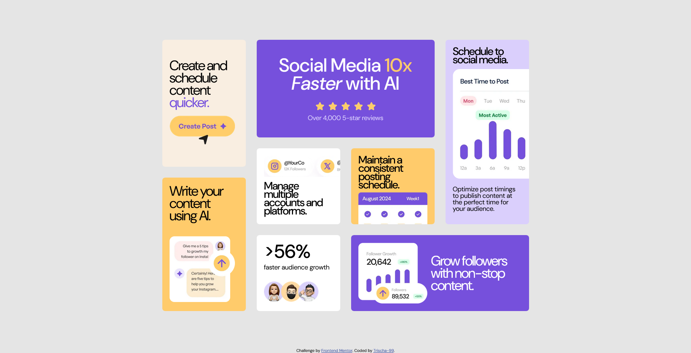

# Frontend Mentor - Bento grid solution

This is a solution to the [Bento grid challenge on Frontend Mentor](https://www.frontendmentor.io/challenges/bento-grid-RMydElrlOj).

## Table of contents

- [Overview](#overview)
  - [The challenge](#the-challenge)
  - [Screenshot](#screenshot)
  - [Links](#links)
- [My process](#my-process)
  - [Built with](#built-with)
  - [What I learned](#what-i-learned)
  - [Continued development](#continued-development)
  - [Useful resources](#useful-resources)

## Overview

### The challenge

Users should be able to:

- View the optimal layout for the interface depending on their device's screen size

### Screenshot




### Links

- Solution URL: [Add solution URL here](https://github.com/Trischa-99/Bento-Grid-with-Flexbox.git)
- Live Site URL: [Add live site URL here](https://trischa-99.github.io/Bento-Grid-with-Flexbox/)

## My Process

### Built with

- HTML
- CSS
- Flexbox

### What I learned

I learned to overcome all the unexpected little problems until I was satisfied with the result.

It was challenging but also interesting to work without a Figma file, relying only on my eyes for measurement. I’m sure I would have been much faster with a Figma file, but my understanding of CSS wouldn’t have grown as much if I had used one.

My favorite is this small piece of code I wrote to push the < symbol a bit higher. I struggled with it more than I probably should have, but I’m proud to have found a solution - even if the result doesn’t change much in the grand scheme of things.

```css
.audience-header span {
  position: relative;
  top: -4px;
}
```

### Continued development

I want to keep refining my styling skills even further. There’s still so much to learn, and I’m already really excited to do so.

### Useful resources

- [MDN Web Docs](https://developer.mozilla.org/de/)
- [W3Schools](https://www.w3schools.com/)

